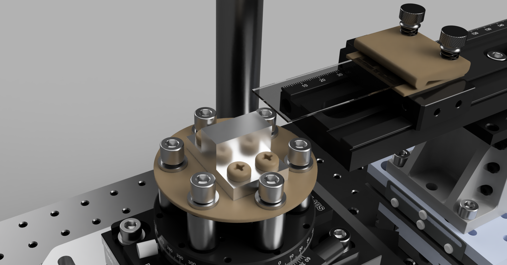
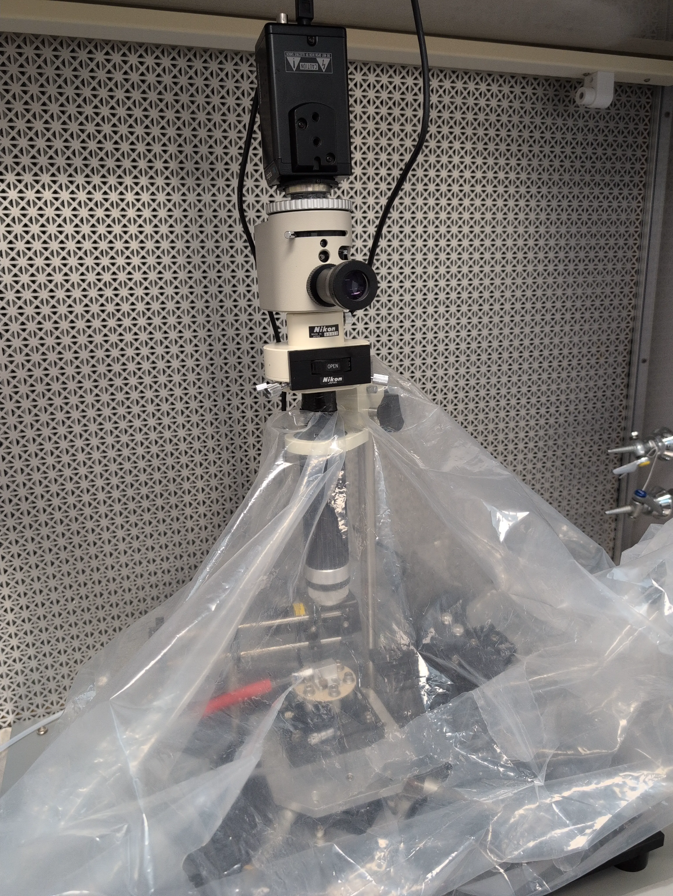
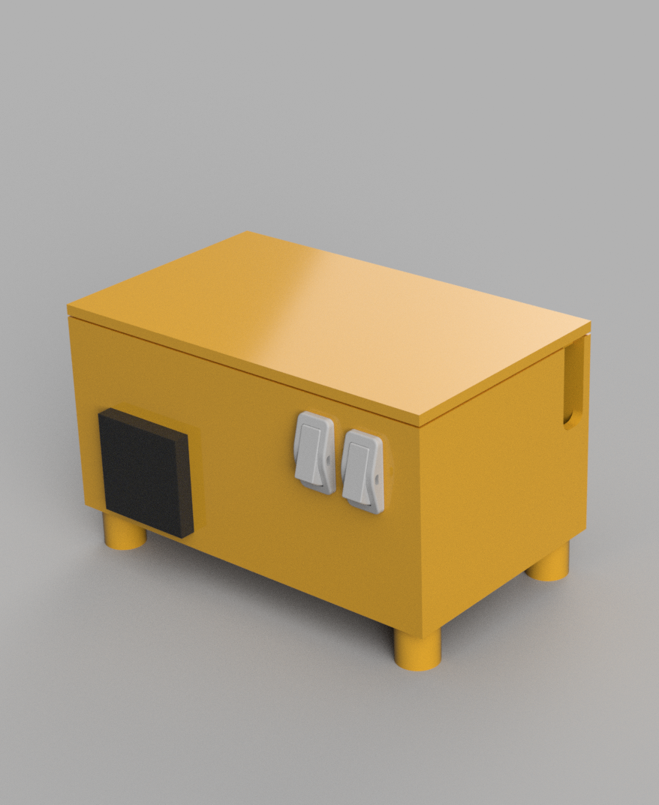
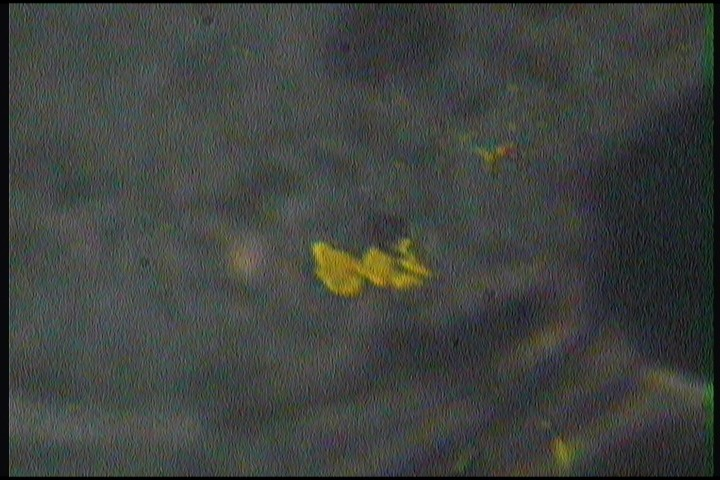
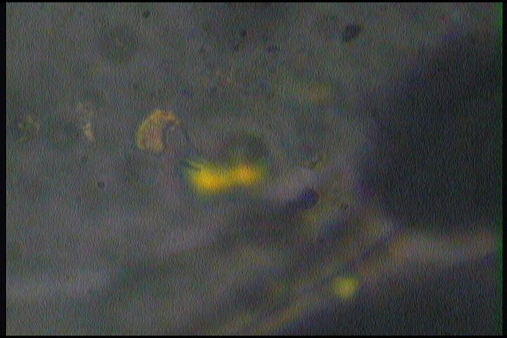

# Custom 2D Transfer Station

Welcome to the repository for my custom 2d material transfer and stacking station. This design uses a combination of existing components found in the lab, and custom components used to turn it into a transfer station. I also included a plastic enclosure for a heater that normally had exposed wall AC. This design was created to be an affordable alternative to more professional systems. 

---

## 📸 Project Gallery

Here are some renders of the custom PCB and the mechanical assemblies:

### 2D Transfer Renders

### 2D Transfer Pic

### Heater Renders

### 2D Materials (h-BN)

---

## ✨ Features

* **High degree of freedom** On the base, you have diagonal x-y movement as well as rotation. On the slide arm, you have x, y, z movements.

* **Vibration isolation** On multiple levels, you have the ability to use vibration dampers for clean life off and stacking of 2D materials.

* **Cost effective** By using some inexpenisve custom parts, you can build a 2D transfer station with equipment you may already have in the lab. For a nitrogen enviroment, you can enclose the station in a glove bag. 

* **Easy slide mounting and changing** With the non-outgassing plastic clamps, you can easily place and switchout glass slides containing the PDMS and PPC needed to pick up atomically thin materials. 

---

## 📂 Repository Structure

* `/3D_Print` - Contains the print files (stl) needed to 3D print the heater enclosure for safe and cheap operation.
* `/Metal` - Contains the CAD files (STEP) and drawings needed to machine the custom metal components.
* `/Plastic` - Contains the CAD files (STEP) and drawings needed to machine and 3D print the custom plastic components.
* `/Media` - Contains various images and videos of the laser assembly.

---

## 📖 Inspirations

1. Kanokwan Buapan, Ratchanok Somphonsane, Tinna Chiawchan, Harihara Ramamoorthy; Versatile, Low-Cost, and Portable 2D Material Transfer Setup with a Facile and Highly Efficient DIY Inert-Atmosphere Glove Compartment Option. ACS Omega 20 July 2021; 6 (28): 17952–17964. https://doi.org/10.1021/acsomega.1c01582

---

## 📝 License

This project is licensed under the [MIT License](License.txt) - see the LICENSE file for details.